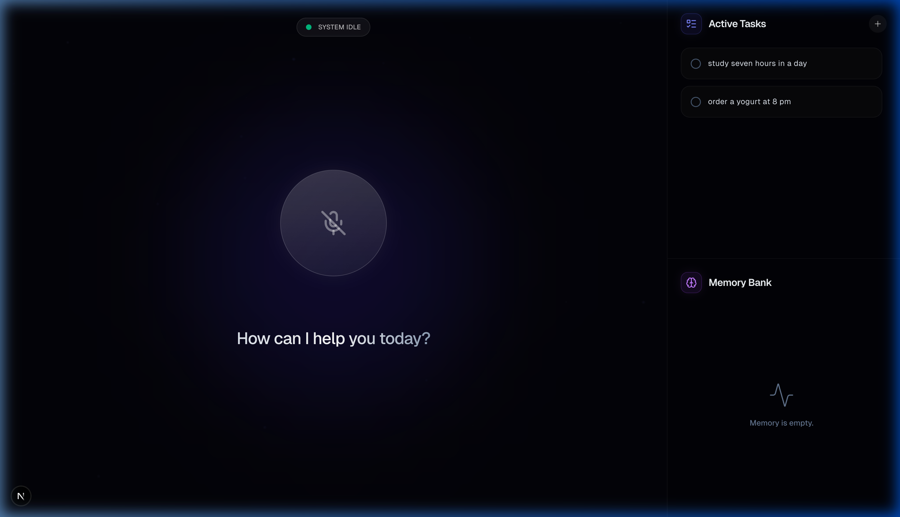

<div align="center">
  <h1>🎙️ AI Voice Agent Dashboard</h1>
  <p>A premium, voice-enabled AI assistant built with Next.js, Gemini API, and Tailwind CSS. It manages your tasks, remembers important context, and converses with you seamlessly through speech.</p>

  
  
  
  
</div>

<br />

<div align="center">
  
</div>

<br />

## ✨ Features

- **🗣️ Full Voice Interaction:** Utilizes the Web Speech API to listen to your voice and speak back naturally.
- **⚡ Real-Time Processing:** Features a dynamic, glowing "Siri-like" orb that reacts to listening, processing, and idle states using `framer-motion`.
- **✅ Intelligent Task Management:** Tell the agent to add, complete, or delete tasks. The sidebar updates instantly.
- **🧠 Long-Term Memory:** Tell the agent facts or preferences (e.g., "Remember that my dog's name is Rex"), and it will store it in the Memory Bank for future context.
- **🌌 Premium Aesthetic:** Deep space glassmorphic design, subtle floating background particles, and crisp UI typography.
- **🛡️ Robust Error Handling:** Smart UI fallback states for high-traffic (Rate Limit 429) or API Key leaks with visual countdowns.

## 🛠️ Tech Stack

- **Framework:** Next.js (App Router)
- **AI Integration:** Google Gemini (`@google/generative-ai`) via Function Calling
- **Styling:** Tailwind CSS + PostCSS
- **Animations:** Framer Motion
- **Icons:** Lucide React
- **Storage:** Local JSON file persistence (`data/todos.json`, `data/memory.json`)

## 🚀 Getting Started

### 1. Clone the repository
```bash
git clone https://github.com/agam263/Voice-agent.git
cd Voice-agent
```

### 2. Install dependencies
```bash
npm install
```

### 3. Configure Environment Variables
You must provide a valid Google Gemini API key. Create a `.env` file in the root of the project:
```env
GEMINI_API_KEY=your_gemini_api_key_here
```
*(Note: Get your free API key from [Google AI Studio](https://aistudio.google.com/))*

### 4. Run the Development Server
```bash
npm run dev
```
Open [http://localhost:3000](http://localhost:3000) in your browser. 
*(For the best voice recognition compatibility, use Google Chrome.)*

## 💡 How to Use

1. Click the large glowing microphone orb in the center.
2. Grant microphone permissions if prompted.
3. Speak naturally! Try saying things like:
   - *"Add 'buy groceries' to my tasks."*
   - *"Mark 'buy groceries' as completed."*
   - *"Delete the grocery task."*
   - *"Remember that my favorite color is crimson."*
   - *"What was my favorite color again?"*

---
*Built as a professional demonstration of AI Agent capabilities, tool-calling, and premium UI/UX design.*
